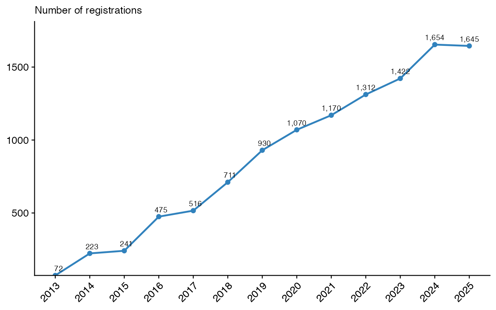
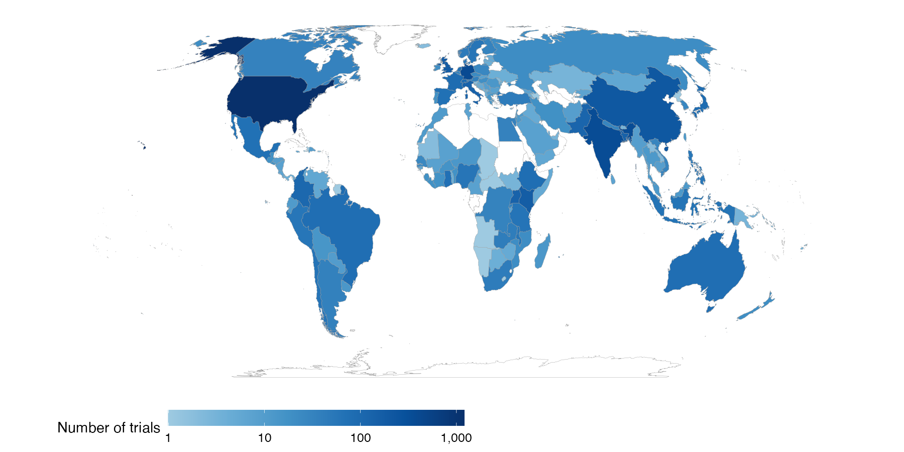
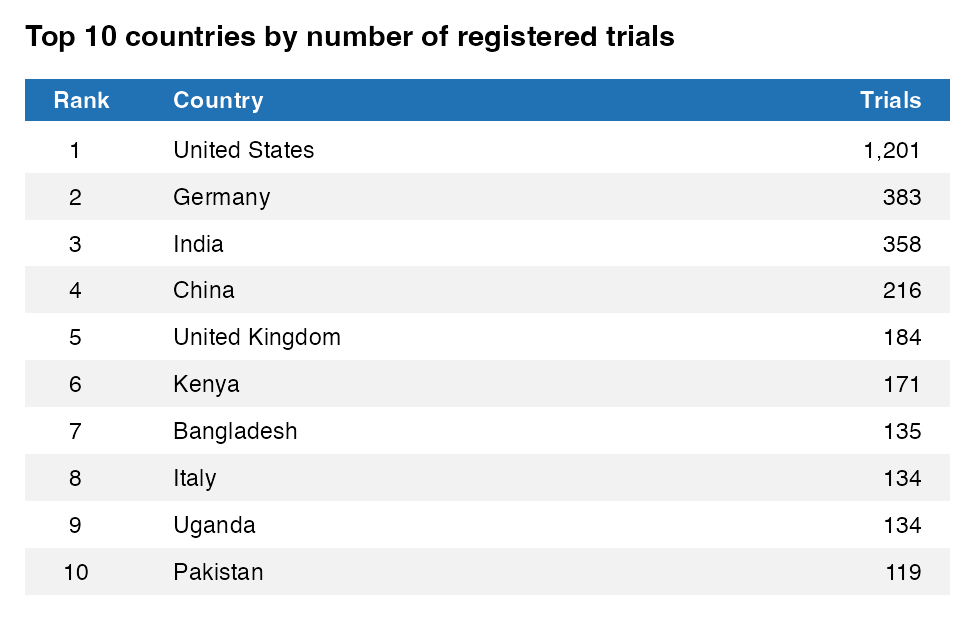

A recent project of mine (that didn't work out) involved downloading the entire AEA Trial Registry for reasons far to complicated to get into. While this is generally a silly thing to do, it did change my views on where economics happens and what gaps exist in our coverage of the world.

But first, some background. For those who don't know, the AEA Trial Registry is a service hosted by the American Economic Association intending to catalog all economics RCTs run anywhere in the world. There are [several good reasons for this](https://www.povertyactionlab.org/resource/trial-registration) but for my purposes here it means we have an relatively exhaustive record of all experiments run by economists since 2013. The AEA enforces this exhaustiveness by refusing to publish RCTs in their journals unless they have been registered, and this might has been working: the total number of registrations has boomed since 2013 as you can see in the graph below. Importantly, these include all *registrations* of experiments, not just published results.

{width="900"}

All this background is no doubt fascinating, but on to the main point of the post. The maps below shows a heat map of where all registered RCTs have been run or are currently running.[^1] Being a development economist, I assumed that most RCTs were run in developing countries, so I thought Africa would light up. It does not. In fact, Africa has the third fewest trials of any continent only above South America and Oceania.

[^1]: NB this is where the trials are run, not where the trial authors are based. I check this about 4 times after seeing the map.

The top 10 countries with the most trials is filled out with mostly the usual suspects. There is a mix of rich countries (Germany, China, the UK) along with social science hot spots (India, Kenya, Uganda). Perhaps unsurprisingly, the United States comes out at the top. What does surprise me is just how big the gap is between the US and Germany in second place: almost 1,000 more trials have been run in the US than in Germany. While [the US still leads the world in R&D spending](https://www.aau.edu/newsroom/leading-research-universities-report/report-shows-us-still-leads-world-rd-now) for now, I think this more so points to the gap in this supposedly exhaustive record of social science trials. The AEA is a US based organization with an English website which likely precludes at least social scientists from for example China from registering there.

We can also see on the map that there still be monsters out there. There are 57 countries and autonomous territories that have not had a single RCT run in them.[^2] These countries make up 232 million people, or almost 3% of the world population! While, most of this comes from the top three–Algeria, Sudan, and Uzbekistan–and many of these are tiny territories like the Isle of Man, that is still a significant fraction of the world that is understudied. Even North Korea has had a trial![^3] Plus [everyone wants to go to Uzbekistan](https://www.nytimes.com/2026/06/15/travel/uzbekistan-central-asia-tourism-tashkent-samarkand.html): they should have some trials.

[^2]: If you or a loved one has run an RCT in any of these countries, please contact me and I fix my country name matching code.

[^3]: [AEA Registry number 16160](https://www.socialscienceregistry.org/trials/16160). They looked at the effect of Facebook users being served no adds in their newsfeeds across a broad swath of countries.

{width="2300"}

The most glaring omission is the lack of trials on [Small Island Developing States](https://www.un.org/ohrlls/content/about-small-island-developing-states) (SIDS) in the Pacific and Indian oceans, and the Caribbean sea. All but three Pacific Island nations are missing (the Solomon Islands, Fiji, and Palau) while 10 out of 16 Caribbean Island nations are missing. SIDS make up less than 1% of the world's population, but this is not a random sample. Development economics (at least the RCT branch of the field) has understudied this important population. Most island countries are poor or middle income—all Oceanian countries except for Australia, New Zealand, and Palau have a [GDP per capita below \$10,000](https://en.wikipedia.org/wiki/List_of_Oceanian_countries_by_GDP)—and face the worst effects from rising sea levels driven by climate change.

## So What?

Knowing the landscape of what economics has studied is important so academics don't fall into the trap of [looking for their keys under the lamppost](https://sketchplanations.com/looking-under-the-lamppost). Economics has blind spots geographically, and places where research money could probably be reallocated away from fairly freely. It's easy to fall into the trap of doing RCT work in countries where the social science infrastructure is already set up.[^4] Where there are existing survey firms and pools of people ready to be hired as enumerators, RCTs can be run with relative ease, but doing so can lessen our knowledge of other communities that could be structurally different for whom our programs and interventions would not work off the shelf.

[^4]: I am certainly guilty of this. All of my RCTs are in Ghana or the US.

Social science should aspire to be universally representative of the world population. While we have made great strides from the [WEIRD](https://news.harvard.edu/gazette/story/2020/09/joseph-henrich-explores-weird-societies/) days of old, we are not there yet.
