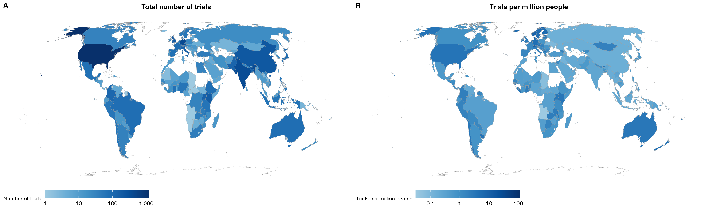
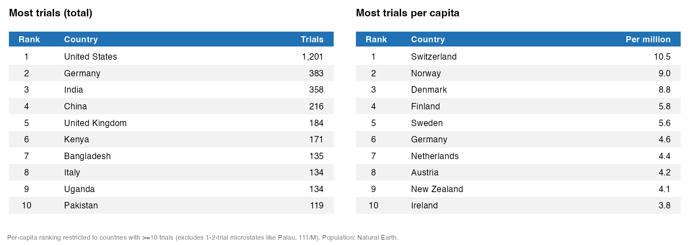
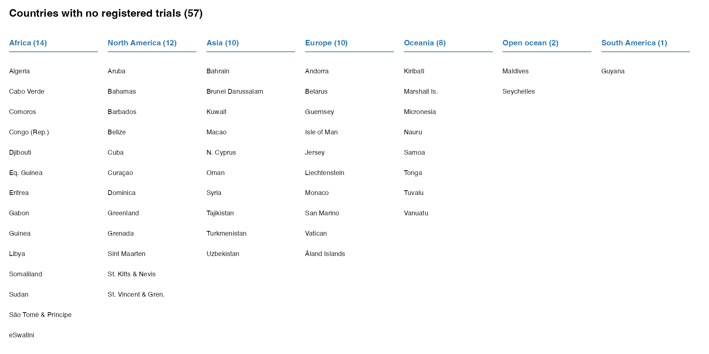

A recent project of mine (that didn't work out) involved downloading the entire AEA Trial Registry for reasons far too complicated to get into. With a few caveats I'll get into shortly, this is an exhaustive record of all RCTs run by economists since 2013. And not just finished and published RCTs either. Economists generally register their trials before the RCT runs, so by looking at this data, we can see the full scope of where RCT style research is happening around the world. Of course not all research is done with RCTs, but they represent a [large](https://voxdev.org/topic/methods-measurement/state-play-development-economics-research) and [still growing](https://paulgp.com/papers/tracking_revolution.pdf) part of the field.

Today, I am going to show you where RCTs happen. Which countries have more RCTs run in them than you might expect, and which countries are missing from the record. There are [several](https://blogs.worldbank.org/en/impactevaluations/whats-latest-research-development-economics-roundup-neudc-2023) ongoing [series](https://www.csae.ox.ac.uk/csae-conference-2021) of conference specific roundups of papers showing where studies happen, but as far as I can tell, no one has tried to look at close to all trials at once.

I am a development economist, so I certainly had some priors about where I thought RCTs happened, but I ended up being very wrong. I expected Africa to light up, but as the map on the left below shows, it does not. Remember importantly that this is showing the country where the RCT happened, *not* the country where the researchers are from.

Let's go through some of the surprises. First, the United States is a massive outlier. There have been almost 1,000 more trials run in the US than the next closest country, Germany. While [the US still leads the world in R&D spending](https://www.aau.edu/newsroom/leading-research-universities-report/report-shows-us-still-leads-world-rd-now) for now, I think this more so points to the gap in this supposedly exhaustive record of social science trials. The AEA is a US based organization with an English website which likely precludes at least social scientists from for example China from registering there. Adjusting by population drops the US out of the top 10, but surprisingly to me the top 10 per capita is still dominated by rich, western countries. Developing countries are represented pretty well in the raw top 10 with India, Kenya, and Bangladesh leading the way, but they sit far behind the US overall and disappear completely when adjusting for population.

Maybe this shouldn't be surprising. Even in development, almost all RCT funding comes from [western institutions](https://voxdev.org/topic/methods-measurement/state-play-development-economics-research) and there are many other fields of economics than development that wouldn't even consider running an experiment outside their home country.

Part of the disparity could be explained by what I'll call "micro experiments". Many headline grabbing experiments are big budget, multi-year endeavors like [this cash transfer study in Kenya](https://www.givedirectly.org/how-do-cash-transfers-impact-neighbors) that spent as much as 15% of the local GDP, but smaller experiments happen all the time. These can be almost costless for a senior professor who can martial undergrads to [trade pencils for mugs](https://thetroublewitheconomics.com/2018/08/10/behavioral-econs-101-the-endowment-effect-and-loss-aversion-part-2-experimental-economics-in-action/) among other things. Micro experiments can be extremely revealing especially about small scale behaviors. But, without the institutional set up a rich university provides, it can be harder for researchers of the Global South to run these more marginal studies. This leaves us with a lack of smaller, quirkier knowledge from non-[WEIRD](https://en.wikipedia.org/wiki/WEIRD) countries.

## Who's Missing?

Micro experiments are not the only gap in the RCT knowledge base. The blank white swaths of land on the map represent the 57 countries and autonomous territories that have not been host to a single RCT, at least since 2013.[^1] You may fairly choose to discount the Isle of Man from your reckoning, but these countries are made up of 232 million people or almost 3% of the world's population. Most of this comes from the top three by population: Algeria, Sudan, and Uzbekistan. While parts of Algeria and Sudan are certainly dangerous to travel to, studies happen in more dangerous places constantly. Even North Korea has had a trial![^2] Uzbekistan is a particularly puzzling omission since [everyone wants to go to Uzbekistan](https://www.nytimes.com/2026/06/15/travel/uzbekistan-central-asia-tourism-tashkent-samarkand.html).

[^1]: If you or a loved one has run an RCT in any of these countries, please contact me and I will fix my country name matching code.

[^2]: [AEA Registry number 16160](https://www.socialscienceregistry.org/trials/16160). They looked at the effect of Facebook users being served no adds in their newsfeeds across a broad swath of countries.

{width="2300"}

The most glaring omission is the lack of trials on [Small Island Developing States](https://www.un.org/ohrlls/content/about-small-island-developing-states) (SIDS) in the Pacific and Indian oceans, and the Caribbean sea. All but three Pacific Island nations are missing (the Solomon Islands, Fiji, and Palau) while 10 out of 16 Caribbean Island nations are missing. SIDS make up less than 1% of the world's population, but this is not a random sample.

There are some decent reasons why RCTs have mostly avoided island nations. Most reasonably is population size. Nauru for example has just 12,100 people living there which is getting close to needing a full census to run a well powered study. Bigger countries like the Federated States of Micronesia are spread over 2,000 islands which would make logistics quite tricky. But as in Algeria and Sudan, people power through these issues in other contexts. Mongolia is one of the most scarcely populated countries on Earth yet ranks as the 45th most studies country per capita. People work around these issues in other places but it has not yet happened for island nations.

Development economics (at least the RCT branch of the field) has understudied this important population. Most island countries are poor or middle income—all Oceanian countries except for Australia, New Zealand, and Palau have a [GDP per capita below \$10,000](https://en.wikipedia.org/wiki/List_of_Oceanian_countries_by_GDP)—and face the worst effects from rising sea levels driven by climate change. People have lived there for at least a millennia, surviving conditions unlike anywhere else on Earth. Surly there are lessons to be learned there.

## So What?

Knowing the landscape of what economics has studied is important so academics don't fall into the trap of [looking for their keys under the lamppost](https://sketchplanations.com/looking-under-the-lamppost). Economics has blind spots geographically, and places where research money could be reallocated away from fairly freely. It's easy to fall into the trap of doing RCT work in countries where the social science infrastructure is already set up.[^3] Where there are existing survey firms and pools of people ready to be hired as enumerators, RCTs can be run with relative ease, but doing so can lessen our knowledge of other communities that could be structurally different and for whom our programs and interventions would not work off the shelf.

[^3]: I am certainly guilty of this. All of my RCTs are in Ghana or the US.

Social science should aspire to be universally representative of the world population. While we have made great strides from the [WEIRD](https://news.harvard.edu/gazette/story/2020/09/joseph-henrich-explores-weird-societies/) days of old, we are not there yet.
