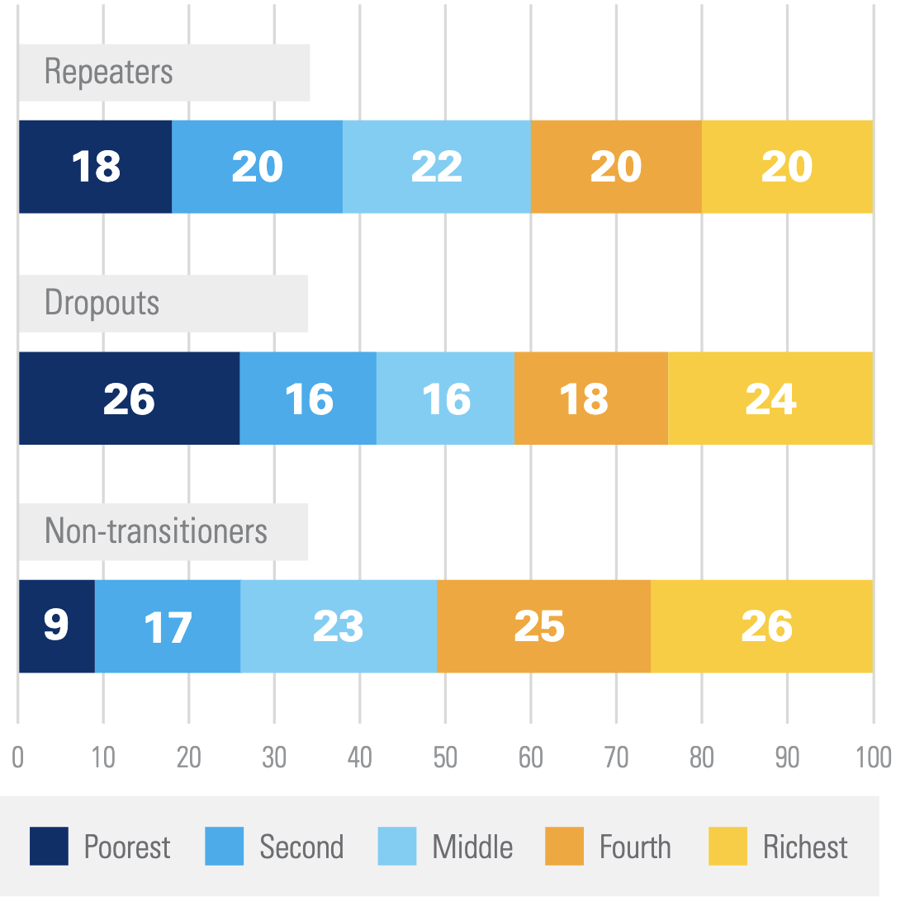
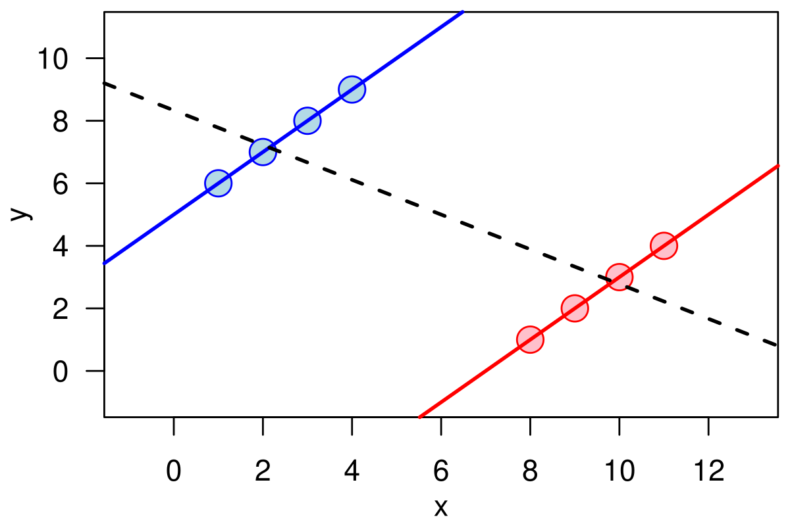
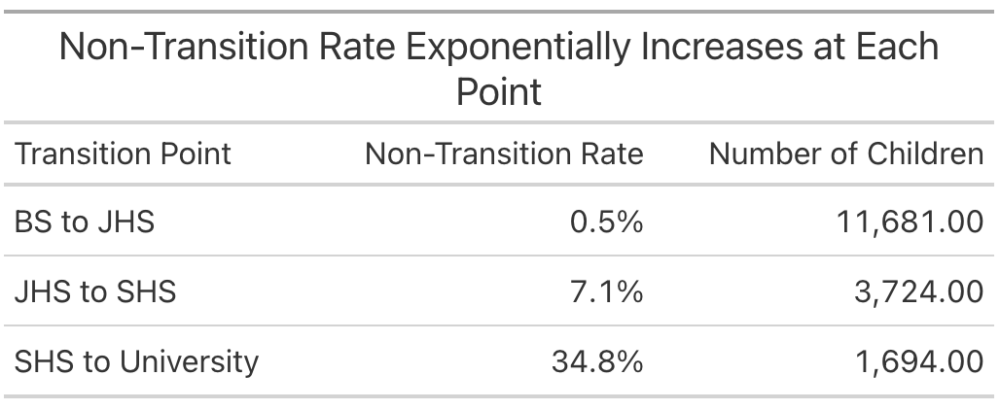
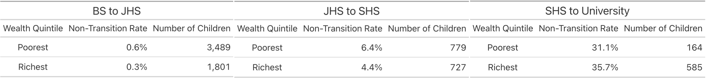

[Here's an interesting fact reported by UNICEF](https://www.gpekix.org/knowledge-repository/mics-eagle-ghana-education-fact-sheets): in Ghana, the poorest children drop out of school at a much higher rate than their richer peers, but unexpectedly if they finished a level of schooling, e.g. finish elementary school, they are much more likely than their peers to carry on and start middle school, high school or university. Children who don't carry on to the next level of schooling are said to have "non-transitioned", and the poorest children in Ghana are stunningly more likely to transition than their peers. Children whose parents earn in the bottom 20% of income non-transition only 9% of the time, while children even marginally richer whose parents fall in the bottom 20 to 40% of incomes non-transition 17% of the time! It gets even worse as children climb the income ladder with the highest income students non-transitioning 26% of the time. A full quarter of upper income students fail to carry on to the next level of schooling at some point in their academic careers. What is going on here? I had some theories and spent quite a bit of time pursuing one, only to find that what we have here is a classic statistical trick called a [Simpson's Paradox](https://pages.stat.wisc.edu/~wardrop/courses/999-2a.pdf), a statistical trick where a pattern in the data can entirely reverse if you look at it at an aggregated versus disaggregated level.

{width="50%"}

## Theorize with Me

Before I walk you through what a Simpson's Paradox is and where it rears its head, and I want to illustrate how dangerous they can be by telling you a theory I came up with to explain this apparent contradiction that I thought was compelling (and spent an embarrassingly long time designing a project to test)[^1].

[^1]: This theory turned out to be wrong, so there are a lot of holes you can poke in it, but the point is you can pretty easily develop a compelling theory to explain whatever statistical artifact you want

Imagine two students: Erik and Thomas. Thomas is from a relatively rich, sophisticated family. His parents are not so wealthy he never has to work, in fact they are highly invested in making sure Thomas does whatever it takes to get the highest paying job he can. In their research, they discover that [sheepskin effects](https://www.americanprogress.org/article/the-sheepskin-effect-and-student-achievement/) where returns to schooling exhibit a big jump after getting a degree from completing a level of schooling are the main driver of returns to education. Finishing sophomore year in high school won't increase your earnings by much, it's only the high school diploma. If Thomas finishes elementary school, but is only a marginal student, unlikely to succeed in the cauldron of middle school, his parents won't make him stick it out. They know the first two years of middle school won't give him any boost in pay, so if he is unlikely to get the coveted middle school diploma, he should drop out right at the start. Thomas, and students like him will thus non-transition quite a lot.

But what about Erik? Erik is from a very poor family who don't have enough time or resources to be able to learn about sheepskin effects. Erik seems to be learning more and more every year, so they assume his post-school income should also be increasing incrementally every year he completes.[^2] To them, there's no reason to favor dropping out at a transition point any more than at any other time. If Erik is a marginal student unlikely to finish high school, so what? He'll stay a couple years, boost his resume, then drop out when the time is right. There are no critical decision making points as there are for the rich, in the know family. If every day of school is equally valuable for earnings, then waiting a few days or years to dropout does no harm. If there are sharp, discontinuous points in the earnings function, there are critical points when parents have to make quick decisions to pull their child out of school to avoid "wasting" time with schooling that provides no direct boost to earnings.

[^2]: Or every day he completes at the extreme.

Together, these effects explain UNICEF's fact. Even though poor children drop out more, their dropouts are distributed throughout their academic careers. Rich children drop out less, but always at these critical transition points. An elegant way to explain the contradiction. I spent a long while designing an intervention to prevent this over investment in education by the poorest students by telling them about sheepskin effects, and thus boosting the lifetime earnings in important ways, and potentially digging the poorest families out of a poverty trap.

The only problem is, the contradiction didn't exist in the first place.

## Lies, Damned Lies, and Statistics

A Simpson's Paradox[^3] where if you consider the whole of your sample, one pattern appears, but if you look at each subgroup, the pattern disappears or reverses itself: missing the trees for the forest. This phenomenon is so clear when you look at it on a picture as to appear obvious, but when faced with real data, and no knowledge that a Simpson's Paradox might be lurking, it is anything but. I'll walk you through the background of Ghana's education system, and see if you can spot the Simpson's Paradox that explains the contradiction before I reveal it[^4].

[^3]: Unfortunately not named after the TV family, but the much less cool Edward H. Simpson who worked as a code breaker during WW2 at Bletchley Park.

[^4]: The data is available [here](https://mics.unicef.org/surveys?display=card&keys=ghana) if you want to play around with it yourself. It's the Ghana MICS6 survey from 2017-18.

{width="50%"}

Ghana has four levels of schooling—basic school (BS), junior high school (JHS), senior high school (SHS), and university—meaning there are three possible non-transition points—BS to JHS, JHS to SHS, and SHS to university. [Like many developing countries](https://academic.oup.com/qje/article-abstract/125/2/515/1882172) (and to a lesser extent developed countries), enrollment drops off precipitously the higher level of school you look at. The overall non-transition rates at those three breaks are given below. Most students make it to JHS, we lose some more going to SHS, then the big culling of enrollment happens as students transition to university.

{width="50%"}

We're interested in looking at this data by income level, so let's break each of those transition points up by income level. I'll just report the poorest and richest students for simplicity's sake. Here's the Simpson's Paradox! At the first two transition points the poorest students are much more likely to non-transition than the richest ones, and at the final transition, they're about equal[^5].

[^5]: The reversal at the final transition point is probably a form of survivor bias. It takes an exceptional student to make it all the way through twelve grades when they have hardly any resources, so by the end you are left with only the best.

{width="100%"}

How can it be that this fact is true, and yet if we aggregate all these together and look at total non-transition rates as UNICEF did, it looks like the poorest students transition at a much higher rate than the rich? Look closely at the table below, and notice the number of poor and rich students at each transition point. Because the rich students transition at a much higher rate at every point, more of them survive to be culled by the massive non-transition rate to university. Poor students, on the other hand, either non-transition early, or drop out at a different point in the year, and so don't exist to be counted at the university transition when almost everyone drops out. Thus the rich students are over-represented at the non-transition points that make up the bulk of the average, while the poor students filter out before they can be properly added up in the average. We end up with a fact that while true is greatly misleading about the situation on the ground.

## So What?

Why am I writing a blog about this? Two reasons. First, I think this is a quite interesting example of a common statistical foible. Even spending too long working on this project and writing this blog, I still find it a bit hard to wrap my head around how this is all true at the same time, so I want to put it out there so other people don't waste as much time figuring it out as I did.

Second and more importantly, this highlights the perils of misleading data presentation. The graph UNICEF made and put in their fact sheet is 100% true and reproducible, but even with their minor note about this being a Simpson's Paradox (which I find completely unclear) it is still misleading. Put yourself in the shoes of a Ghanaian policy maker[^6]. The fact sheet is designed to provide easily digestible information to policy makers that they can act on to improve Ghana's education system, but any policy made on the basis of this fact alone would be harmful. My idea was that the poorest students were over investing in education and wasting potential earning years, but they are not. As we saw when we dug deeper into this data, as we might expect a priori, the poorest students get significantly less education than their richer peers, so any policy helping them prevent over investing in education would only push the poorest students farther behind. Presenting the data in a way that better represents the truth on the ground can help make sure good development money isn't thrown after bad facts.

[^6]: Or a poor PhD student looking for a project.

As scientists, and especially scientists in development where our work can directly impact where large amounts of money are spent, we should aspire to not just find and report all things that are true, but to represent them in the most honest way we can. Facts that are misleading are the most dangerous kind of misinformation, and having scientists (or politicians) arbitrating on what makes a fact misleading leads you down all kinds of dangerous paths, and yet it is still our responsibility to do so, to find the right route through the garden of all knowledge, keep discovering things about the world, and share them.
